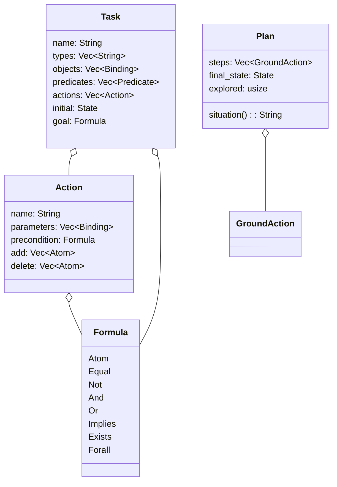
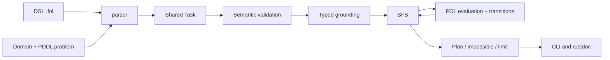
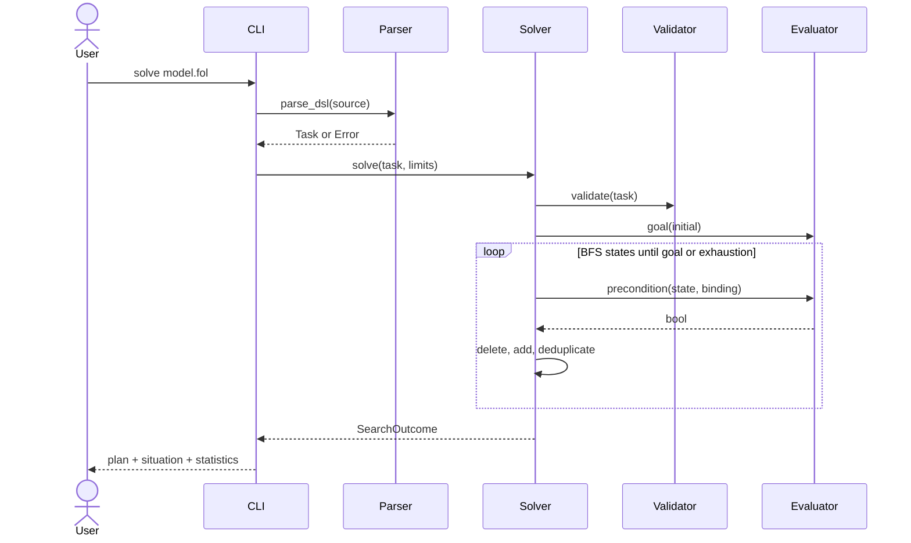

# Architecture and contracts

A Rust crate `pddl_fol`, with a `folplan` binary and no external dependencies.







## Module responsibilities

`model.rs`: data structures and `Error`; `logic.rs`: validation/evaluation;
`planner.rs`: grounding, BFS, plan replay; `dsl.rs`: coordinate-aware infix DSL
lexer/parser; `parser.rs`: standard PDDL S-expression parser; `main.rs`: I/O and arguments; `lib.rs`: API
and rustdoc.

API fixed before delegation (public fields for programmatic construction):

```text
Binding { name: String, ty: String } // variables stored without a '?' prefix
Term::{Variable(String), Constant(String)}
Atom { predicate: String, terms: Vec<Term> }
GroundAtom { predicate: String, arguments: Vec<String> }
State = BTreeSet<GroundAtom>
Predicate { name: String, parameters: Vec<String> } // types, not names
Formula::{Atom(Atom), Equal(Term,Term), Not(Box<Formula>), And(Vec<Formula>),
 Or(Vec<Formula>), Implies(Box<Formula>,Box<Formula>),
 Exists(Vec<Binding>,Box<Formula>), Forall(Vec<Binding>,Box<Formula>)}
Action/Task: fields from diagram, delete (not del)
Error { message: String }, Error::new(impl Into<String>), Display, std::error::Error
ErrorKind::{InvalidInput, GroundingLimit}; Error::kind() -> ErrorKind
parse_dsl(&str) -> Result<Task, Error>
parse_pddl(domain: &str, problem: &str) -> Result<Task, Error>
validate(&Task) -> Result<(), Error>
evaluate(&Task, &State, &Formula) -> Result<bool, Error> // closed formula
SearchLimits { max_states: usize, max_ground_actions: usize }, Default: 100000 each
GroundAction { name: String, arguments: Vec<String> }, Display: (name args...)
Plan { steps: Vec<GroundAction>, final_state: State, explored: usize }
Plan::situation(&self) -> String
SearchOutcome::{Solved(Plan), Unsolvable { explored: usize }, LimitReached { explored: usize }}
solve(&Task, SearchLimits) -> Result<SearchOutcome, Error>
replay(&Task, &[GroundAction]) -> Result<State, Error>
```

`solve` and `replay` always validate the Task. `evaluate` checks the formula,
state, and model; the engine internally uses an already-validated evaluation.
Grounding-limit errors have kind `ErrorKind::GroundingLimit`; all other model
and input errors have kind `ErrorKind::InvalidInput`. DSL and PDDL names are
ASCII case-insensitive and normalized to lowercase. No `unsafe`.
