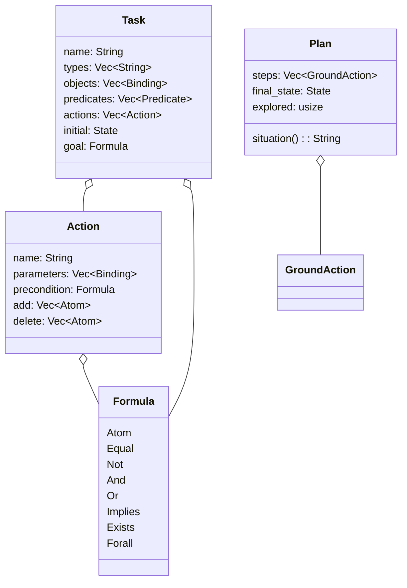
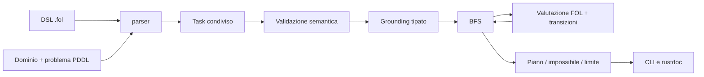
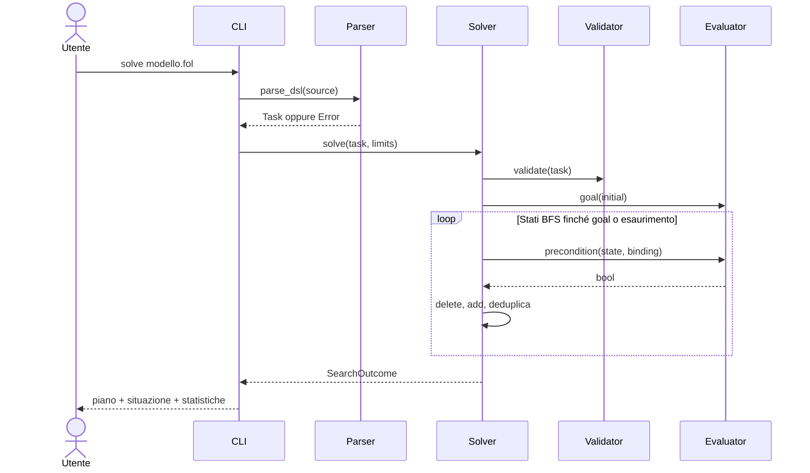

# Architettura e contratti

Un crate Rust `pddl_fol`, binario `folplan`, nessuna dipendenza esterna.







## Proprietà dei moduli

`model.rs`: strutture dati e `Error`; `logic.rs`: validazione/evaluazione;
`planner.rs`: grounding, BFS, riproduzione piani; `parser.rs`: lexer S-expression
con coordinate, DSL e PDDL; `main.rs`: I/O e argomenti; `lib.rs`: API/rustdoc.

API fissata prima delle deleghe (campi pubblici per costruzione programmatica):

```text
Binding { name: String, ty: String }
Term::{Variable(String), Constant(String)}
Atom { predicate: String, terms: Vec<Term> }
GroundAtom { predicate: String, arguments: Vec<String> }
State = BTreeSet<GroundAtom>
Predicate { name: String, parameters: Vec<String> } // tipi, non nomi
Formula::{Atom(Atom), Equal(Term,Term), Not(Box<Formula>), And(Vec<Formula>),
 Or(Vec<Formula>), Implies(Box<Formula>,Box<Formula>),
 Exists(Vec<Binding>,Box<Formula>), Forall(Vec<Binding>,Box<Formula>)}
Action/Task: campi nel diagramma, delete (non del)
Error { message: String }, Error::new(impl Into<String>), Display, std::error::Error
parse_dsl(&str) -> Result<Task, Error>
parse_pddl(domain: &str, problem: &str) -> Result<Task, Error>
validate(&Task) -> Result<(), Error>
evaluate(&Task, &State, &Formula) -> Result<bool, Error> // formula chiusa
SearchLimits { max_states: usize, max_ground_actions: usize }, Default: 100000 entrambi
GroundAction { name: String, arguments: Vec<String> }, Display: (name args...)
Plan { steps: Vec<GroundAction>, final_state: State, explored: usize }
Plan::situation(&self) -> String
SearchOutcome::{Solved(Plan), Unsolvable { explored: usize }, LimitReached { explored: usize }}
solve(&Task, SearchLimits) -> Result<SearchOutcome, Error>
replay(&Task, &[GroundAction]) -> Result<State, Error>
```

`solve` e `replay` validano sempre Task. `evaluate` controlla formula, stato e
modello; il motore usa internamente una valutazione già validata. Nomi DSL e PDDL
ASCII case-insensitive, normalizzati in minuscolo. Nessuno `unsafe`.
